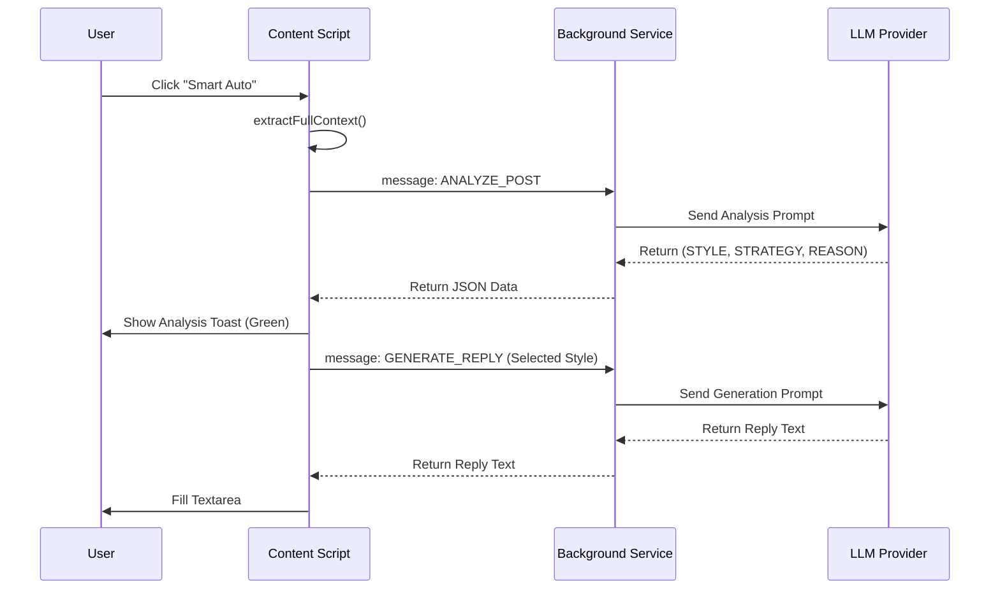

# Smart Auto Analysis (智能分析回覆)

## 1. 功能概述 (Overview)
**Smart Auto (智能分析)** 是 SonarChrome 擴充功能中的核心 AI 功能。不同於傳統隨機選擇回覆風格，Smart Auto 採用「先思考，再行動」的兩階段策略。它會先閱讀貼文的情境（Context），分析出最適合的回覆策略（Strategy）與風格（Style），並向用戶解釋理由後，才生成最終的回覆內容。

這確保了回覆不僅僅是有趣的，而且是**語氣恰當且符合情境**的。

---

## 2. 核心流程 (Core Workflow)

Smart Auto 的運作分為兩個明顯的階段：

### 階段一：情境分析 (Phase 1: Context Analysis)
1.  **用戶觸發**：點擊回覆區的 `✨` 按鈕。
2.  **內容提取**：系統抓取當前貼文內容，以及主文內容（如果是樓中樓）。
3.  **AI 決策**：
    *   系統將貼文內容發送給 AI。
    *   AI 評估貼文情緒（憤怒、悲傷、分享、搞笑等）。
    *   AI 從 10+ 種預定義風格（Chill, Spicy, Support...）中選擇**最佳的一個**。
    *   AI 生成一句話的「回覆策略」跟「選擇理由」。

### 階段二：內容生成 (Phase 2: Content Generation)
1.  **UI 回饋**：前端收到分析結果，立即彈出 Toast 通知：
    *   ✨ **策略**：(例如：先同理對方的困擾...)
    *   💬 **理由**：(例如：對方語氣顯得焦慮)
2.  **執行生成**：系統自動使用 AI 剛才選定的風格 ID，呼叫標準的 `GENERATE_REPLY` 接口。
3.  **完成**：將生成的文字填入 Textarea。

---

## 3. 技術架構 (Technical Architecture)

### 3.1 前端 (Content Script) - `src/content.ts`
*   **`handleSmartAuto(post)`**: 主入口函數。
    *   負責調用 `extractFullContext` 獲取完整文本。
    *   顯示 `showLoadingState`。
    *   發送 `ANALYZE_POST` 訊息給 Background。
    *   接收回傳結果，解析 `STYLE`, `STRATEGY`, `REASON`。
    *   調用 `showSuccessMessage` 顯示綠色分析結果 Toast (8秒)。
    *   最後調用 `this.generateReply(post, targetStyle)` 執行生成。

### 3.2 後端 (Background Service) - `src/background.ts`
*   **`handleAnalyzePost(data)`**: 處理分析請求。
    *   構建專用的 **Analysis Prompt**。
    *   調用 AI 模型（優先使用用戶設定的模型）。
    *   回傳包含 Style ID 和解釋的原始文字。

### 3.3 數據流 (Data Flow)



---

## 4. Prompt 設計 (Prompt Engineering)

為了確保 AI 的輸出能被程式碼解析，我們使用了嚴格的 Output Format約束。

### 分析提示詞 (Analysis Prompt)
位於 `background.ts` 的 `handleAnalyzePost` 方法中：

```text
你是 Threads 社群專家。請閱讀以下貼文，並從「可用風格列表」中選擇 **最適合** 的一種回覆風格。

【貼文內容】：
...

【輸出格式（嚴格遵守）】：
STYLE: [風格名稱 ID]
STRATEGY: [一句話回覆策略]
REASON: [選擇此風格的簡短理由]

**只輸出上述三行，不要輸出其他任何內容。**
```

---

## 5. 驗證與測試 (Verification)

要確認此功能是否正常運作，請檢查以下關鍵指標：

1.  **Toast 通知**：點擊按鈕後，是否在生成文字**之前**，先看到一個顯示「策略：...」與「理由：...」的綠色通知？
2.  **Console Log**：
    *   前端 Console 應顯示：`✨ 策略：...`
    *   擴充功能背景 Console 應顯示：`✅ 分析成功` 與原始的 AI 回應。
3.  **風格一致性**：生成的文字內容是否真的符合 AI 所宣稱的策略？（例如策略是「吐槽」，生成的文字是否帶有吐槽語氣？）
