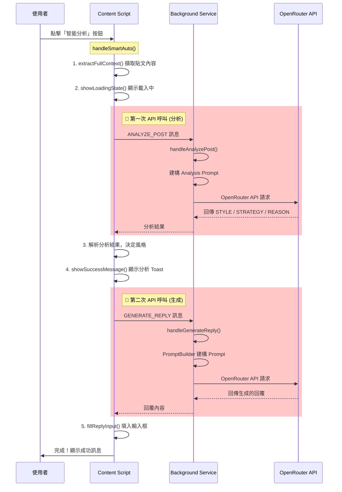

# SonarChrome 智能分析回覆流程與效能分析

## 🔄 完整流程概覽



---

## ⏱️ 延遲來源分析

### 主要瓶頸：**兩次 API 呼叫**

智能分析模式 ([handleSmartAuto](file:///Users/yehcho/coding/SonarChrome/src/content.ts#1674-1757)) 會執行 **兩次** AI API 呼叫：

| 順序 | 呼叫類型 | 目的 | 預估延遲 |
|:---:|:---|:---|:---:|
| 1 | `ANALYZE_POST` | 分析貼文語意，決定最佳回覆風格 | **1.5-3 秒** |
| 2 | `GENERATE_REPLY` | 根據分析結果生成回覆內容 | **1.5-3 秒** |

**總延遲：3-6 秒（網路和模型負載影響）**

---

## 🔍 各階段詳細分析

### 階段 1: 內容擷取 ([extractFullContext](file:///Users/yehcho/coding/SonarChrome/src/content.ts#1624-1673))
- **延遲**: 接近 0 (本地 DOM 操作)
- **運作**: 擷取目標貼文 + 主文脈絡（若存在）

### 階段 2: 分析 API 呼叫 (`ANALYZE_POST`)
- **延遲**: **1.5-3 秒** ⚠️ **瓶頸**
- **運作**: 
  - 建構分析 Prompt（包含貼文內容 + 所有可用風格列表）
  - 呼叫 OpenRouter API
  - 回傳 `STYLE` / `STRATEGY` / `REASON`

### 階段 3: 解析分析結果
- **延遲**: 接近 0 (正則表達式解析)
- **運作**: 解析 AI 回傳的 STYLE、STRATEGY、REASON

### 階段 4: 生成 API 呼叫 (`GENERATE_REPLY`)
- **延遲**: **1.5-3 秒** ⚠️ **瓶頸**
- **運作**:
  - 使用 `PromptBuilder.buildReplyPrompt()` 建構完整 Prompt
  - 包含 Persona、Style Strategy、Visual Rules 等
  - 呼叫 OpenRouter API 生成回覆

### 階段 5: 填入回覆框 ([fillReplyInput](file:///Users/yehcho/coding/SonarChrome/src/content.ts#2251-2278))
- **延遲**: 接近 0 (DOM 操作)

---

## 🚨 已識別的效能問題

### 1. **雙重 API 呼叫是設計使然**
```typescript
// content.ts - handleSmartAuto()
// 第一次呼叫：分析
const response = await browser.runtime.sendMessage({
  type: 'ANALYZE_POST',
  data: { postText: finalPostText, stylesList }
});

// ...解析結果...

// 第二次呼叫：生成
await this.generateReply(post, targetStyle, strategy, true);
```

這是 **「分析後生成」** 架構的必然結果。

### 2. **人為延遲**（可移除）
在 [generateReply](file:///Users/yehcho/coding/SonarChrome/src/lib/providers/openrouter.ts#22-91) 中發現刻意加入的等待：

```typescript
// content.ts:1741 (非 SmartAuto 模式)
await new Promise(r => setTimeout(r, 600));  // 600ms 延遲

// content.ts:1833
await new Promise(r => setTimeout(r, 1200)); // 1.2 秒延遲
```

> [!NOTE]
> 這些延遲在 `isSmartAutoMode = true` 時 **已被跳過**，不影響智能分析。

### 3. **Vision 處理**（條件性）
如果啟用 Vision 功能，會額外：
- 抓取圖片 URL
- 可能增加 ~1 秒延遲（`setTimeout(r => r, 1000)`）

---

## 💡 優化建議

### 短期優化（不改變架構）

| 優化項目 | 影響 | 難度 |
|:---|:---|:---:|
| 確認 `isSmartAutoMode` 正確跳過人為延遲 | 減少 0.6-1.2 秒 | 低 |
| 選用更快的 AI 模型（如 `gemini-2.0-flash-exp`） | 減少 0.5-1 秒 | 低 |
| 優化 Prompt 長度（減少 token 數） | 微幅改善 | 中 |

### 中期優化（架構調整）

| 優化項目 | 影響 | 難度 |
|:---|:---|:---:|
| **合併兩次 API 呼叫為一次** | 減少 1.5-3 秒 | 中高 |
| 前端快取常用貼文分析結果 | 避免重複分析 | 中 |
| 串流回應（Streaming Response） | 感知速度提升 | 中 |

### 長期優化

| 優化項目 | 影響 | 難度 |
|:---|:---|:---:|
| 本地輕量模型做初步分類 | 大幅減少 API 依賴 | 高 |
| 預測性預載（User Hover 時開始分析） | 感知 0 延遲 | 高 |

---

## 📊 建議的合併 API 呼叫方案

目前的雙呼叫設計：
```
[分析 Prompt] → API → [結果] → [生成 Prompt] → API → [回覆]
```

可以合併為：
```
[分析+生成 Prompt] → API → [分析結果 + 回覆]
```

合併後的 Prompt 結構：
```
你是 Threads 社群專家。

【任務 1 - 分析】
閱讀以下貼文，選擇最適合的回覆風格，並說明策略和理由。

【任務 2 - 生成】
根據你選擇的風格，生成一條回覆。

【輸出格式】
STYLE: ...
STRATEGY: ...
REASON: ...
---
REPLY: [實際回覆內容]
```

**預估改善**: 節省 1.5-3 秒（一次 API 呼叫的時間）

---

## ✅ 結論

智能分析回覆流程 **「感覺很慢」** 的主因是：

> **兩次串行的 AI API 呼叫，每次 1.5-3 秒**

這是目前 「分析→生成」 架構的必然結果。若要顯著提升速度，建議考慮 **合併兩次 API 呼叫為一次**。
